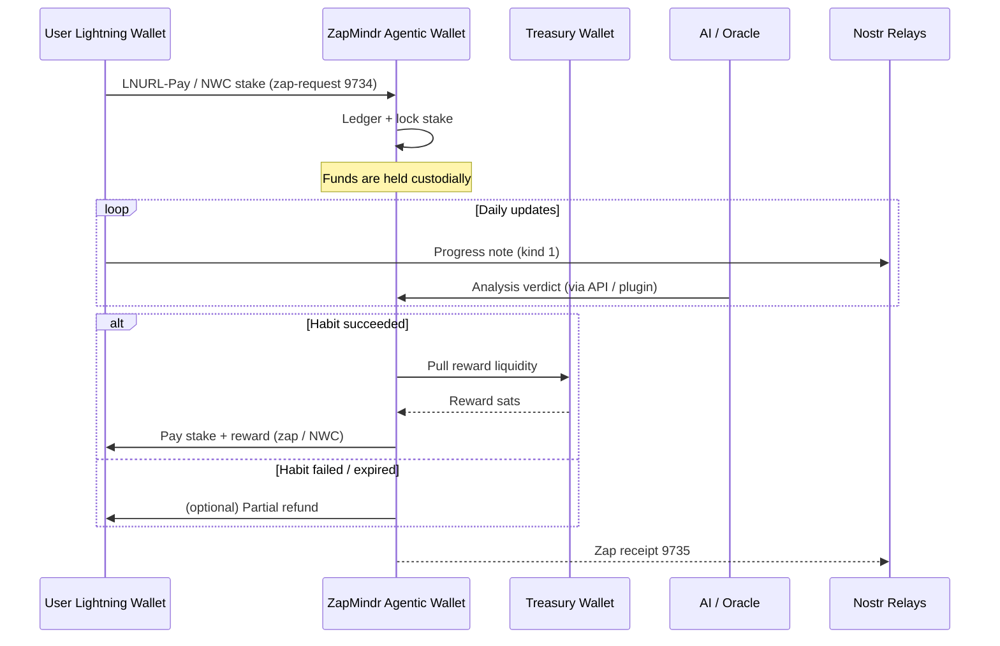

# ZapMindr

A lightning-powered habit tracker built for the Nostr ecosystem. Users **stake sats** on their habits, post daily updates, and – if the AI/Oracle verifies honest progress – earn back their stake + rewards.

---

## Quick Overview

- React + Redux smart-widget (works inside any Nostr client that supports YakiHonne widgets)
- AI-assisted progress verification (mocked locally – pluggable with real LLM)
- Lightning pay-in / pay-out via LNURL-Pay, NWC, **and** NIP-57 zap-requests
- Minimal shared-custody ledger until more advanced escrow is live

> **Smart Widget Handler SDK Integration :**
>
> - Using official YakiHonne SDK (SWHandler) for:
>   - Nostr login/authentication ([App.jsx](https://github.com/Vib-UX/agentic-mini-apps/blob/main/mini-app-04.ai-habit-tracker/src/App.jsx))
>   - Nostr post publishing ([PostUpdateModal.jsx](https://github.com/Vib-UX/agentic-mini-apps/blob/main/mini-app-04.ai-habit-tracker/src/Components/PostUpdateModal.jsx#L286))
>   - Payments & staking ([PaymentHelpers.jsx](https://github.com/Vib-UX/agentic-mini-apps/blob/main/mini-app-04.ai-habit-tracker/src/Helpers/PaymentHelpers.jsx#L459))
>   - Staking service address: `zapmindr@wallet.yakihonne.com` ([PaymentHelpers.jsx](https://github.com/Vib-UX/agentic-mini-apps/blob/main/mini-app-04.ai-habit-tracker/src/Helpers/PaymentHelpers.jsx#L1046))
> - Backend custodian node: `zapmindr@wallet.yakihonne.com`

---

## Payment Architecture (v0)

**Scenario:** ZapMindr runs an _agentic wallet_ – a custodial LND node (or payment service) that temporarily holds stake deposits on behalf of users. A separate **Treasury** wallet tops-up ZapMindr so it can pay out rewards.



### Why shared-custody first?

- Works with **every** wallet – just scans an invoice.
- Simplifies AI adjudication (single source of truth).
- We can upgrade to non-custodial escrow later (see roadmap).

---

## Roadmap for Trust-Minimised Escrow

| Stage | Tech                 | What it gives                                                   | Status                                 |
| ----- | -------------------- | --------------------------------------------------------------- | -------------------------------------- |
| **1** | Hold-Invoices (Hodl) | Funds locked in HTLC, refundable                                | Supported in LND, easy next step       |
| **2** | **BOLT-12 Offers**   | Static offers + built-in refund flow                            | In Core Lightning, experimental in LND |
| **3** | **PTLC escrow**      | Oracle-based settlement inside Lightning using Taproot channels | Research / spec work                   |
| **4** | DLC-style on-chain   | Fully cryptographic, node-agnostic escrow                       | Future, higher fees                    |

> • **BOLT-12** will let ZapMindr hand out a single “Stake Offer” per habit; the user’s wallet will request a real invoice and later request a refund automatically.  
> • **PTLC** (Point-Time-Locked Contract) can embed the oracle’s signature as the settlement key, removing the need for ZapMindr to intervene.

---

## How it Works (TL;DR)

1️⃣ **Stake** – choose a habit, set how many sats you’re willing to lock in.

2️⃣ **Post** – tap “Post Update”, share your progress. Our AI gives it a quick honesty check.

3️⃣ **Zap** – if you’re on-track the stake **plus** a reward is zapped back to your wallet (auto-pay via NWC or a QR invoice).

---

## Running Locally (devs only)

```bash
npm i && npm run dev
```

---

Happy zapping & habit-building! ⚡🧠
